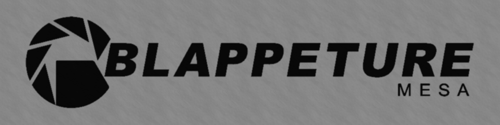

 
 
 
 
 

# Into The Multiverse Assets Repository
The assets repository for the Into The Multiverse Portal 2 map series. Assets and other original assets from the original 7z file pablo.emanuel shared, but it has been organized and sorted for proper use. The original 7z file has also been rezipped into a zip file for those who don't have 7-Zip. Other test maps and other assets relating to the Into The Multiverse series are uploaded. In summary, this repository essentially is a reorganized version of the original 7z file designed for use with Git.

***PLEASE READ!!!*** Instructions for working with Into The Multiverse maps:

These instructions assume you're using a Windows 10 or 11 system, as they have the best compatibility. MacOS has barely, if not any, support for Valve's tools and games, primarily due to Apple dropping 32-bit support applications, which are most of Valve's products. Wine or some other compatibility layer tool could work, but you must do your own research and do it yourself. As for Linux, the only proper working Hammer editor for the platform (that we know of) would be Portal 2: Community Edition's Hammer Editor because of their direct support for the platform. It's under a closed beta and is still being worked on, so it might not be the most stable. I tried Wine for Hammer and Hammer++, the load and buttons function, but due to them not having the right graphics software for Linux, the view windows will not render them pretty much useless. This case might be the same for MacOS. Please let us know if you know of any way to get either working for Linux.

***IMPORTANT: This repository uses Git LFS to store and handle the big files. You need to have it installed and initialized for you to access LFSed files. [Install Git LFS](https://git-lfs.com/)***

1. Clone this repository; ensure the destination is in a folder with no files.
2. Read the ABSOLUTELY READ ME RIGHT NOW YOU MAD MAN.txt file. It's a message from Blappature, and I recommend you read it.
3. Move the repo to a new folder in the maps folder in the sdk_content folder of your Portal 2 install. The full path from your Portal 2 folder should be: Portal 2/sdk_content/maps/(repository here)
4. Git or GitHub Desktop will freak out that it can't find the repository; make sure to redirect it to the new place you moved it.
5. Three ways to use the Into The Multiverse Assets in Hammer

   A. (The stick it in there and forgetta bout it way, easy difficulty)

   Take the contents of the assets folder and stick it into the portal2 folder. Replace the files if asked. It is easy to access the Into The Multiverse assets, but it is hard to remove them if you don't want the assets anymore. Proceed to step 6.

   B. (The move to own game folder way, medium difficulty)

   Make an itmv folder in your Portal 2 folder, and stick all the contents of the assets folder in the repository in the "itmv" folder. Add "itmv" to your gameinfo.txt in the portal2 folder. This way will allow Portal 2 and Hammer to access the assets in an organized manner. Proceed to step 6, but if you want to avoid copying over files every time there is an update...

   C. (The lengthy symbolic link way, hard difficulty, but I **recommend** it)

   This way is similar to B, but you're not moving any files. It mimics where files are located and seen in Portal 2. For those who don't know what a symbolic link is, it's where a file system object points to another file system object. In simpler terms, you can have a folder act like another folder in a different part of your file system. An example is FolderA/SubFolderA/SubSubFolderA, which can be symbolically linked to SymbolicLink/SubFolderA/SubSubFolderA. You could call it a shortcut, but it's more a mirrored copy of the original files. Anyway, how to do it though? There are two ways:

      C1. Link Shell Extension

      Go to the Link Shell Extension download page and get your system's version: https://schinagl.priv.at/nt/hardlinkshellext/linkshellextension.html#download. Once that's done, install it; once that's done, go to where the assets folder of the repository is located. Select it, then right-click the assets folder and click "Pick Link Source" in the menu. For Windows 11, you must click the "Show More Options" button to see the options. Go to your Portal 2 base folder, right-click, hover over "Drop  As..." then click "Symbolic Link". All you have to do next is rename it to "itmv" and add the folder to your gameinfo.txt file in your portal2 folder. If you're using Hammer++, you can also make a symbolic link to your CSGO game folder. That should be all, move on to step 6.

      C2. Administrator Command Prompt

      You must open a command prompt window with administration permissions to make this symbolic link. You shouldn't need to give it admin permissions in Windows 11 to make a symbolic link, but just in case, go ahead and start one with admin. Next, navigate to the location where the assets folder is. Now to symlink it, type or copy the following command **(THIS HERE ASSUMES PORTAL 2 IS INSTALLED AT THE DEFAULT LOCATION! ADJUST AS NEEDED!)**:

   `mklink /D "C:\Program Files (x86)\Steam\steamapps\common\Portal 2\itmv" "C:\Program Files (x86)\Steam\steamapps\common\Portal 2\sdk_content\maps\itmv\assets"`.

   Add the new symbolic link folder to your gameinfo.txt. Proceed to step 6.

7. Test if the assets work by loading one of the original maps in Hammer. Don't save the map; keep the originals as original copies. If you accidentally save, you can discard the changes with Git (or GitHub Desktop, whichever you use) or get a new original copy from the ITMV_Original_Files_ZIP.zip file.
8. Congrats! If everything appears correctly in Hammer, and when you load up a test map like mp_coop_itmvcoop_elements_testroom.vmf and see the func_instance in there is showing, then you've done everything correctly. Yippie!
